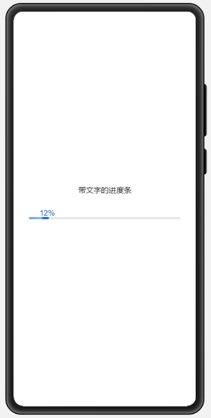
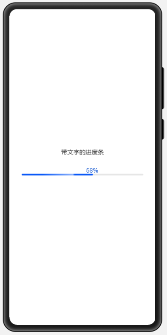
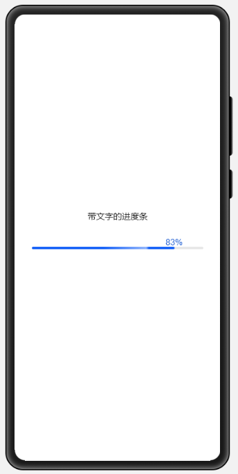

# OhProgressWithText

#### 组件介绍
-   本示例是OpenHarmony自定义组件ProgressWithText。

    在原来进度条的上方加了一个文本框，动态显示当前进度并调整位置。

#### 调用方法
 ```
<element name="progresswithtext" src="../progresswithtext/progresswithtext.hml"></element>
<div class="container">
    <text>{{title}}</text>
    <progresswithtext percent="88" style="width: 600px; height: 150px;" ></progresswithtext>
</div>
 ```

#### 参数介绍
| **参数**                      | **含义**                      |
| :-------------------------: | :------------------------------- |
| percent                        | 当前百分比的值             | 


#### 效果演示

-   12%
    


-   58%
    


-   83%
    
